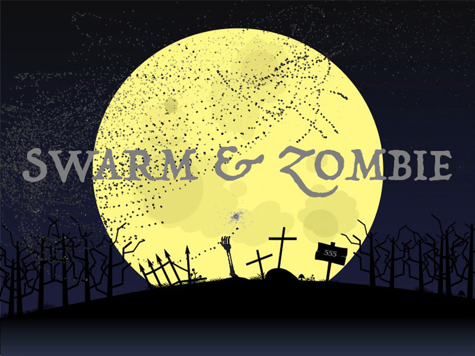
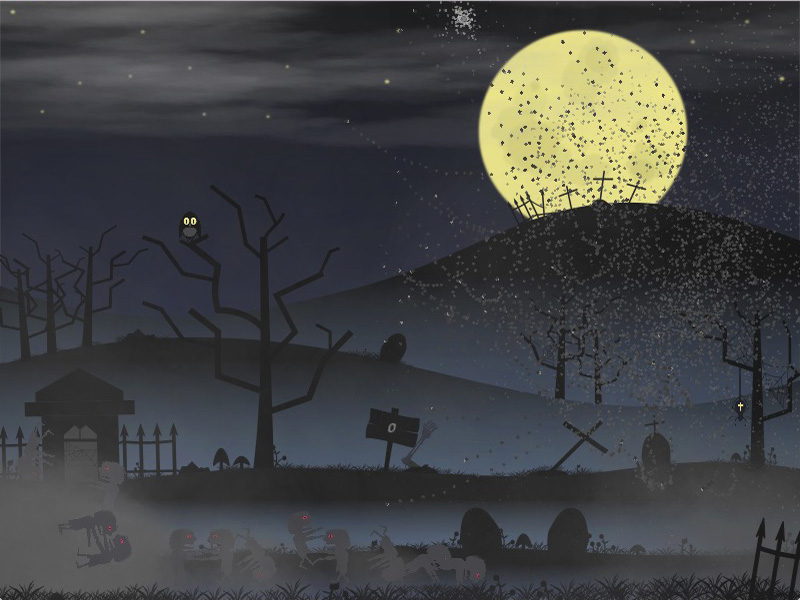
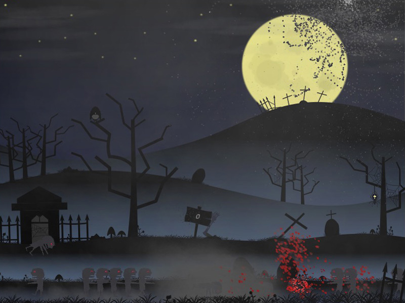

# Swarm & Zombie

v1.5

"Swarm & Zombie" is a small game inspired by experimental project "Attack of the Killer Swarm".

Goal: Try to pick up zombies and splatter them.

Controls: Use mouse to set goal for the swarm. Swarm try to catch goal, but usually fly too fast to stop near target.

HINT: To start playing hit "dead hand". To kill zombie try to lift zombie in the cloud.

Made with Love2d and self-made UI library on top of Love Engine.

[Release available for Mac OS 64-bit & for Windows 32-bit](https://github.com/schwarzbox/Swarm/releases)

To run source code: clone repository, download & install [LÖVE 11.3](https://love2d.org) for you system and run swarm.love

